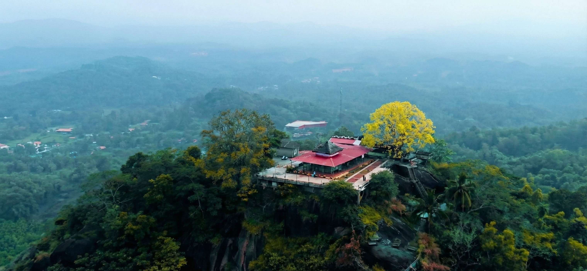

# 🕉️ Narahari Parvatha Sadashiva Temple Website

 

## 📖 About The Project

This project is a digital initiative designed to preserve and promote the cultural heritage of the **Narahari Parvatha Sadashiva Temple** (Bantwal, Karnataka). Often referred to as the *"Kailasa of the Earth,"* this temple holds significant mythological importance dating back to the Mahabharata.

This website serves as a comprehensive guide for devotees and tourists, providing information on the temple's history, the significance of the 333 steps, the four sacred Teerthas (ponds), festival schedules, and Seva offerings.

**Purpose:** Developed as part of an **Academic Social Outreach Program** to help the temple administration improve their digital presence.

---

## ✨ Key Features

- **🎨 Modern UI/UX:** Built with a "Mobile-First" approach using **Tailwind CSS** for a responsive and clean design.
- **📜 Rich History Section:** Detailed storytelling of the legend of Arjuna (Nara) & Krishna (Hari) and howcasing the 4 Sacred Ponds (Shanka, Chakra, Gadha, Padma).
- **🗓️ Festival Guide:** Detailed information on major events like *Aati Amavasye* and *Shivarathri*.
- **💰 Seva List:** Clear, easy-to-read table of offerings and prices for devotees.
- **🔍 SEO Optimized:** Fully configured with **Server-Side Metadata**, OpenGraph tags (for WhatsApp/Social previews), Sitemap, and Robots.txt for maximum search engine visibility.

---

## 🛠️ Tech Stack

- **Framework:** [Next.js 16](https://nextjs.org/) (App Router)
- **Styling:** [Tailwind CSS](https://tailwindcss.com/)
- **Icons:** [Lucide React](https://lucide.dev/)
- **Deployment:** [Vercel](https://vercel.com/)

---

## 🚀 Getting Started

Follow these instructions to run the project locally on your machine.

### Prerequisites
- Node.js installed (v18 or higher)
- npm or yarn

### Installation

1. **Clone the repository**
   ```bash
   git clone [https://github.com/your-username/narahari-temple-project.git](https://github.com/your-username/narahari-temple-project.git)
   cd narahari-temple-project

2. **Install dependencies**
   ```bash
   npm install

3. **Run the development server**
   ```bash
   npm run dev

4. **Open your browser Navigate to http://localhost:3000 to view the site.**

## Project Structure
  ```bash
  ├── app/                  # Next.js App Router
  │   ├── layout.js         # Global Layout & SEO
  │   ├── page.js           # Home Page
  │   ├── history/          # History Page
  │   ├── festivals/        # Festivals Page
  │   ├── sevalist/         # Seva List Page
  │   ├── sitemap.js        # SEO Sitemap
  │   └── robots.js         # SEO Robots
  ├── components/           # Reusable Components (Navbar, Footer, etc.)
  ├── public/               # Static Assets
  │   └── images/           # Temple photos
  └── ...
```
##📢 Credits & Disclaimer

- Images: Photographs used in this project are courtesy of local news networks (e.g., Daijiworld, Udayavani) and respective copyright owners.

- Usage: These assets are used strictly for educational and non-commercial purposes to demonstrate web development skills and promote local heritage.
<h2 align="center">Built with ❤️ for Tulu Nadu.</h2>
